<div align="center">


<p>
  
  
  
  
  
  
  
  
  
</p>

<p>
  <a href="https://bittencourtthulio.github.io/expxdev/"><strong>📘 Documentação do método</strong></a>
  &nbsp;·&nbsp;
  <a href="#as-seis-etapas">Etapas B1–B6</a>
  &nbsp;·&nbsp;
  <a href="#o-ecossistema-expx">O ecossistema</a>
  &nbsp;·&nbsp;
  <a href="#expx-schema-v1">Contratos</a>
  &nbsp;·&nbsp;
  <a href="#instalação">Instalação</a>
</p>

<strong>A camada de orquestração do método Expx</strong> — uma descrição entra,<br>
um sistema sai, para <a href="https://claude.com/claude-code">Claude Code</a> e <a href="https://opencode.ai">OpenCode</a>.

</div>

Descreva o sistema inteiro que você quer. O buildx faz **uma única pergunta** — autônomo ou briefing — e depois conduz `prodx`, `stackx`, `sprintx` e `mergex` até o sistema estar construído, testado e validado. Nenhuma outra pergunta chega a você:

<p align="center">
  
</p>

```bash
npx expxdev init          # instala o buildx e o resto do método no seu harness
```

```

/buildx "quero um sistema para gestão de contratos, com upload de PDF,
         alerta de vencimento e relatório mensal por cliente"
```

> **Ele não implementa nada, não planeja nada e não escreve teste nenhum.**
> Toda a competência mora nas camadas irmãs. A única coisa que o buildx faz e nenhuma outra faz é quebrar um projeto em features — o vão entre "quero um sistema de gestão de contratos" e "planejar a feature de upload de PDF".

---

## Por que existir

O ecossistema Expx tem uma camada para cada etapa. O `prodx` decide se um pedido vale virar trabalho. O `sprintx` planeja e executa **uma** feature com rigor. A `mergex` entrega. O `stackx` formaliza as convenções. O `memox` lembra.

Falta a pergunta que nenhuma delas responde: **quais são as features?**

Entre "quero um sistema de gestão de contratos" e "planejar a feature de upload de PDF" existe um trabalho que ninguém fazia — recortar um sistema inteiro em fatias do tamanho que o sprintx sabe planejar, na ordem certa, sem esquecer o que ninguém pediu e todo sistema precisa ter.

É esse vão que o buildx preenche. Tudo mais ele delega:

- **Uma descrição entra, um sistema sai** — o humano gasta o esforço uma vez, na descrição e na escolha do modo.
- **Uma única pergunta**, sempre a primeira. No modo autônomo, nenhuma outra chega a você — de nenhuma camada.
- **Tudo que foi decidido no seu lugar vira premissa auditável**, registrada antes de ser usada, com o que ela assume e o que a invalidaria.
- **A varredura do que você não pediu** — trinta e quatro eixos não-funcionais percorridos sempre, nenhum pulado em silêncio.
- **Regra de negócio nunca é chutada.** Requisito não-funcional tem padrão defensável; regra de negócio não tem, porque ela é o negócio.
- **Bloqueio nunca para o laço** — registra, marca a feature e segue para a próxima. É o B5 que decide o que fazer com ela.
- **O merge continua sendo humano.** O buildx entrega PRs abertos, verdes e descritos, e para ali.

---

## As seis etapas

```

B1 CONCEPÇÃO → B2 FUNDAÇÃO → B3 DECOMPOSIÇÃO → B4 CONSTRUÇÃO → B5 RECURSÃO → B6 VALIDAÇÃO
                                                      ↑                │
                                                      └────────────────┘
```

Estritamente sequenciais. O buildx descobre onde está **inspecionando o disco**, não perguntando — você nunca precisa dizer "estou na etapa X":

<p align="center">
  
</p>

A máquina de estados, com o que faz cada transição acontecer:

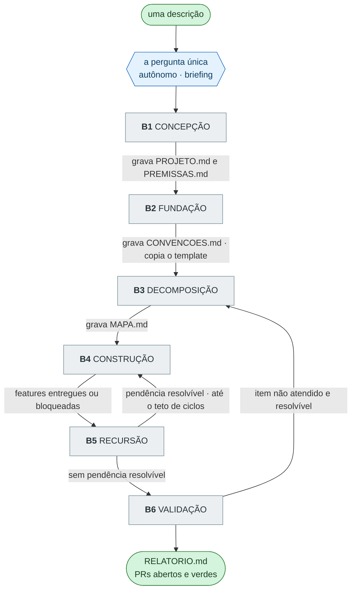

| | Etapa | O que acontece | Quem trabalha |
|---|---|---|---|
| **B1** | Concepção | mapeia o escopo e **varre o que você não pediu** — autenticação, LGPD, auditoria, backup, observabilidade. Cada lacuna vira premissa registrada | `prodx` |
| **B2** | Fundação | escolhe a stack, instala a suíte Expx e **copia o template** que já instala, sobe e testa | `stackx` |
| **B3** | Decomposição | **quebra o projeto em features**, com ordem de dependência e contrato por feature | só o buildx |
| **B4** | Construção | o laço: por feature, branch → plano → auditoria → execução TDD → PR | `sprintx`, `mergex` |
| **B5** | Recursão | classifica o que ficou pelo caminho e devolve ao laço o que a máquina resolve, com teto de ciclos | buildx |
| **B6** | Validação | confere o construído contra o mapa, item a item, e relata | `prodx` |

O que acontece dentro do laço do B4, entre o buildx e as camadas que ele invoca:

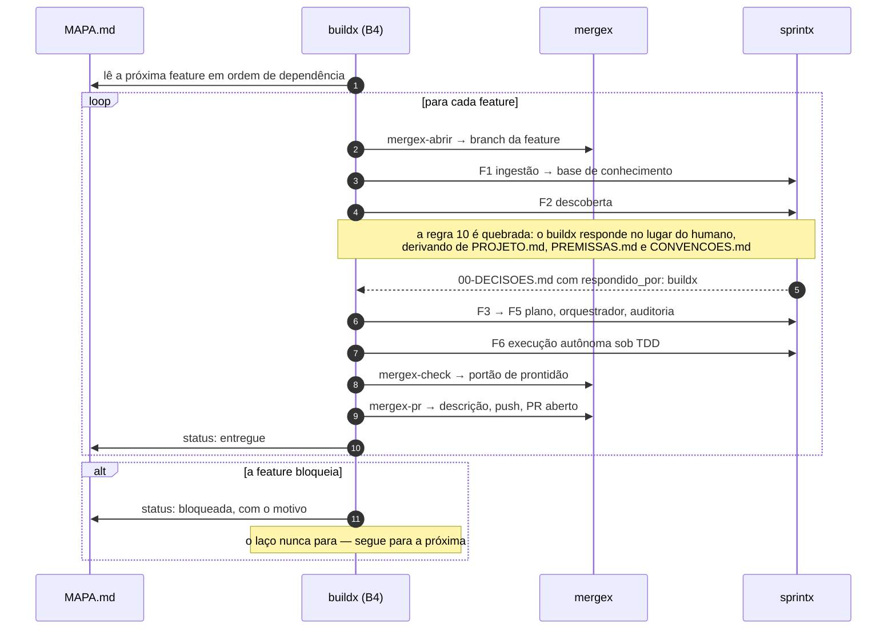

### Comandos

| Comando | O que faz |
|---|---|
| `/buildx <descrição>` | o comando único: recebe o projeto inteiro e conduz até o fim |
| `/buildx` | roteador: detecta a etapa pelo disco e continua de onde parou |
| `/buildx-mapa` | **B3** — mostra ou regera a decomposição em features |
| `/buildx-retomar` | retoma um projeto interrompido, pelo estado em disco |
| `/buildx-status` | painel seco: features, ciclos, pendências, premissas |

---

## O ecossistema Expx

O método Expx é um conjunto de skills que se compõem, instaladas e mantidas pelo CLI [`expxdev`](https://github.com/bittencourtthulio/expxdev). O buildx fica **acima** de todas e invoca uma camada por etapa — e o B3 é a única que é trabalho dele:

<p align="center">
  
</p>

| Peça | Papel | Relação com o `buildx` |
|---|---|---|
| **[expxdev](https://github.com/bittencourtthulio/expxdev)** | o CLI: instala, atualiza e diagnostica o ecossistema | é quem instala esta skill (`npx expxdev init`) |
| **[prodx](https://github.com/bittencourtthulio/prodx)** | **camada** de produto: decide **se** há trabalho | abre o projeto no B1 (modo greenfield) e o valida no B6 — **obrigatório** |
| **[sprintx](https://github.com/bittencourtthulio/sprintx)** | **Build** — feature nova, F1…F6 | planeja e executa cada feature do mapa, no B4 — **obrigatório** |
| **[mergex](https://github.com/bittencourtthulio/mergex)** | entrega: branch, commit por task, PR e pacote de QA | abre a branch, verifica prontidão e monta o PR, no B4 — **obrigatório** |
| **[stackx](https://github.com/bittencourtthulio/stackx)** | **camada** de convenções do repositório | grava o `CONVENCOES.md` no B2, invertido: decide em vez de detectar |
| **[memox](https://github.com/bittencourtthulio/MemoX)** | **camada** de memória do projeto | consultado no B5, para não repetir uma tentativa que já falhou |
| **[modulex](https://github.com/bittencourtthulio/modulex)** | catálogo de integrações já resolvidas | responde no B3 se a feature já tem módulo pronto; recebe de volta, no B6, o que virou módulo novo |
| **[runx](https://github.com/bittencourtthulio/runx)** | **Run** — ocorrência em produção, E1…E5 | não participa: o buildx constrói, não corrige |
| **[legadox](https://github.com/bittencourtthulio/legadox)** | **camada** de segurança para código legado | não participa: projeto novo não tem legado |
| **buildx** *(este repositório)* | orquestra um projeto inteiro | — |

O buildx é a única peça do método que **depende** de outras: sem `prodx`, `sprintx` e `mergex` ele não roda, e diz o que falta. Não é falta de educação, é a arquitetura — rodar sem elas significaria reimplementar quatro skills mal, dentro de uma quinta. O `stackx`, o `memox` e o `modulex` são opcionais e degradam com aviso.

Detalhes do ecossistema inteiro no [README do expxdev](https://github.com/bittencourtthulio/expxdev).

---

## A decomposição: a peça que só existe aqui

O B3 converte a descrição numa lista ordenada de features, cada uma do tamanho que o sprintx sabe planejar. Repare que a descrição menciona **três** coisas e o mapa tem **nove features** — as outras vieram da varredura de lacunas, e cada uma aponta a premissa que a justifica:

<p align="center">
  
</p>

Toda feature do mapa declara, obrigatoriamente:

| Campo | Conteúdo |
|---|---|
| `id` | `FT-NN` |
| `slug` | o `<slug-da-feature>` que o sprintx vai usar em `docs/<slug>/` |
| `titulo` | título curto |
| `entrega` | o que o usuário do sistema consegue fazer que não conseguia |
| `depende_de` | `[ids]` ou `[]` |
| `paralelizavel` | `true` \| `false` |
| `origem` | `descricao` \| `premissa` \| `recursao` \| `template` |
| `status` | `pendente` \| `em_andamento` \| `entregue` \| `bloqueada` |

A ordem não é negociável em dois pontos: a **feature de fundação vem primeiro**, e nenhuma feature precede aquilo de que depende. A `FT-01` é sempre a fundação — autenticação, usuário e papéis —, e carrega junto o **esqueleto de aplicação**: painel inicial, Configurações com cadastro de usuários, perfil e troca de senha. Não é escopo do sistema, é a moldura dele.

O mapa inteiro desse exemplo, feature a feature e com o porquê de cada uma, está em [`exemplos/mapa.exemplo.md`](exemplos/mapa.exemplo.md).

---

## O que ele descobre que você não pediu

A varredura de lacunas é a razão de o buildx existir em vez de você falar direto com o sprintx. Trinta e quatro eixos, percorridos sempre, cada um com um de três destinos:

<p align="center">
  
</p>

| Família | Eixos | O que entra |
|---|---|---|
| **Segurança e acesso** | L1–L9 | autenticação, autorização por papéis, hash de senha, sessão, validação de entrada, segredos, transporte, rate limit, dependências vulneráveis |
| **Dado e conformidade** | L10–L15 | mapeamento de dado pessoal, LGPD com exclusão e exportação reais, trilha de auditoria, retenção, backup **com restauração testada**, migrations reversíveis |
| **Operação** | L16–L21 | log estruturado sem dado pessoal, erro que não vaza rastro, rota de saúde, observabilidade, configuração que falha no start e não em produção, deploy reprodutível |
| **Qualidade** | L22–L25 | TDD, lint e formatação, pipeline de verificação, semente de dados |
| **Interface** | L26–L34 | o design system do VS Code nas duas variantes, tema, responsividade, acessibilidade, estados de vazio/carregando/erro, e as quatro telas do esqueleto |

Cada eixo tem três destinos possíveis: **pedido** (a descrição mencionou), **descoberto** (virou premissa) ou **descartado** (não se aplica, com o porquê registrado). Nenhum é pulado em silêncio — e o B6 confere a lista dos três. Descartar é resposta legítima; a ausência do item é que não é.

O catálogo completo, com o padrão sensato de cada eixo, está em [`references/02-lacunas.md`](.claude/skills/buildx/references/02-lacunas.md).

---

## Tudo que foi decidido por você fica auditável

Cada decisão tomada em seu nome vira uma premissa com cinco campos, e o quinto é o que importa:

<p align="center">
  
</p>

```

PR-07 — Autorização por papéis

Decisão:  papéis admin e usuario desde a primeira feature,
          verificados no servidor.
Por quê:  o sistema tem dado de mais de um usuário; sem papel,
          qualquer conta alcança o dado de qualquer outra.
O que
invalida: se todo usuário tiver exatamente o mesmo acesso aos
          mesmos dados, de forma permanente.
```

**Como revisar dezenas de decisões em cinco minutos:** leia só o campo *o que invalida*. Se aquilo é verdade no seu caso, a premissa merece atenção. Se não é, siga — e você não leu os outros quatro campos.

---

## Os padrões da casa

O que o buildx assume quando você não diz nada. Você sempre ganha do padrão. E o esqueleto ele **não gera**: copia um template real, versionado nesta skill, que já passa no CI.

<p align="center">
  
</p>

| | |
|---|---|
| **Arquitetura** | três camadas, fronteira explícita |
| **Stack** | Next.js, TypeScript, App Router |
| **Banco** | SQLite local — dependência mínima é requisito de execução autônoma |
| **Autenticação** | própria, JWT, hash forte |
| **Demonstração** | usuário e dados de exemplo, sempre — um sistema que sobe numa tela de login vazia é indistinguível de um sistema quebrado |
| **Esqueleto** | painel inicial, cadastro de usuários em Configurações, perfil e troca de senha — **em toda entrega**, porque ninguém pede e todo sistema com login precisa |
| **Ponto de partida** | um **template real**, com código e 61 testes verdes, copiado para a raiz. O buildx não gera o esqueleto: ele parte de um que já passa no CI |
| **Visual** | o design system do **VS Code** — tokens Dark+ e Light+, tipografia do sistema, grade de 4px, e a estrutura de barra de atividade, barra lateral e barra de status |
| **Design** | a skill de frontend design da Anthropic, trabalhando dentro desses tokens |
| **Método** | o projeto **nasce com a suíte Expx instalada**, Claude Code e OpenCode configurados |

Gerar o esqueleto custaria milhares de tokens para produzir, a cada projeto, uma variação **não verificada** do que já estava verificado. O template não traz nenhuma entidade de domínio nem regra de negócio: o que depende do seu pedido continua nascendo no B4, sob TDD, sem exceção.

---

## A fronteira que ele não atravessa

**O buildx decide como o sistema se protege, não o que o sistema faz.**

<p align="center">
  
</p>

Requisito não-funcional tem padrão defensável por classe de sistema — um sistema sem rate limit tem um defeito conhecido. Regra de negócio não tem padrão: ela é o negócio. Um sistema com a regra de cálculo errada **funciona e está errado**, que é o pior resultado possível, porque parece pronto e ninguém procura o defeito.

Regra de negócio que você não declarou nunca é chutada. Ela vira pendência, o buildx segue com a decisão mais reversível possível, e o relatório final **abre** com ela.

### O que ele quebra de propósito

O modo autônomo viola regras que existem por bons motivos nas camadas irmãs. Cada violação é deliberada, restrita ao modo, e registrada no artefato que ela toca:

| Regra violada | Camada | Como fica |
|---|---|---|
| "a skill não decide, humano assina" | prodx R1 | o buildx assina, com `provisorio: true` e `aprovado_por: buildx (modo autonomo)` |
| "nada vai ao sprintx sem veredito assinado" | prodx R2 | a auto-assinatura do buildx satisfaz o portão |
| "a F2 é obrigada a perguntar ao humano" | sprintx R10 | o buildx responde, tudo em `00-DECISOES.md` com `respondido_por: buildx` |
| "convenção só se registra com evidência no código" | stackx | no B2 a origem é `decidido_pelo_buildx`, não um arquivo |

**O que ele nunca quebra:** o TDD do sprintx, a regra de que task só fecha com os dois testes passando, a auditoria da F5, e a proibição de segredo em artefato. Credencial que faltar vira pendência no `RECURSAO.md`, nunca um valor inventado.

---

## E o merge é seu

O buildx entrega PRs abertos, verdes e descritos — com o pacote de teste manual de cada feature, executável por quem não programa.

<p align="center">
  
</p>

Ele não faz merge, não oferece, não sugere que faria. Todas as outras coisas que ele faz sozinho são reversíveis: uma premissa errada se corrige, um plano ruim se replaneja. Merge é onde o trabalho vira o sistema, e é a última rede antes de produção.

Um buildx que faz merge sozinho não é mais autônomo — é irreversível. São coisas diferentes.

---

## O que você lê no fim

<p align="center">
  
</p>

```

1. O QUE VOCÊ PRECISA DECIDIR       as regras de negócio que não foram declaradas
2. O QUE VOCÊ PRECISA PROVIDENCIAR  credenciais, acessos, contas
3. O QUE FOI DECIDIDO POR VOCÊ      as premissas, com o que invalida cada uma
4. O QUE FICOU PRONTO               features entregues, com os PRs
5. O QUE NÃO FICOU                  pendências, com o porquê
6. COMO RODAR                       instalar, subir, entrar com o usuário demo
7. O QUE FAZER AGORA                revisar os PRs e fazer merge
```

A ordem é deliberada: **o que exige ação vem antes do que foi feito.** Um relatório que abre com nove features entregues e esconde na página três que a regra de cálculo foi chutada é desonesto na estrutura, mesmo dizendo tudo.

---

## expx-schema v1

Todo artefato de estado carrega um **frontmatter YAML legível por máquina**, para que um painel de operação leia o andamento do projeto sem depender de prosa. O painel apenas **lê**; a skill continua sendo a única a escrever:

<p align="center">
  
</p>

```yaml
---
expx_schema: 1
expx_tool: buildx
kind: projeto
projeto_id: gestao-de-contratos
titulo: Sistema de gestao de contratos
modo: autonomo            # autonomo | briefing
criado_em: 2026-08-30
atualizado_em: 2026-08-30
etapa: b4                 # b1 | b2 | b3 | b4 | b5 | b6 | concluido
descricao_original: docs/projeto/PROJETO.md#descricao-original
total_features: 9
features_entregues: 3
features_bloqueadas: 0
ciclos_recursao: 2
---
```

O contrato v1 nasceu com duas ferramentas que descrevem o estado de um **trabalho** — `sprintx` e `runx`, costurados por `trabalho_id`. O buildx acrescentou um nível acima: ele grava o estado de um **projeto**, costurado por `projeto_id`. Um projeto tem N trabalhos, um por feature do mapa.

A ponte entre os dois níveis são duas chaves que a cadeia acrescenta ao artefato de cada feature: `origem_buildx` (o `projeto_id`) e `feature_id` (o `FT-NN`). São elas que permitem olhar qualquer plano de sprint e saber de qual projeto e de qual feature do mapa ele veio.

Kinds do buildx: `projeto`, `premissas`, `mapa`, `recursao`, `validacao` e `relatorio` — os únicos do contrato sem `trabalho_id`. Contrato completo em [`references/00-schema.md`](.claude/skills/buildx/references/00-schema.md).

---

## Estrutura em disco

Tudo do projeto fica sob `docs/`, ancorado na raiz do repositório Git mais próxima. Em projeto novo sem `.git`, o B2 inicializa o repositório antes de qualquer coisa.

```

docs/
  projeto/
    PROJETO.md        o escopo completo, o que foi pedido e o que foi descoberto
    PREMISSAS.md      toda decisão tomada em nome do humano
    MAPA.md           as features, em ordem de dependência
    RECURSAO.md       pendências por ciclo, e o teto
    VALIDACAO.md      a conferência final do prodx
    RELATORIO.md      o que o usuário lê no fim
  produto/            do prodx
  stack/              do stackx
  <slug-da-feature>/  do sprintx, uma pasta por feature do MAPA.md
```

---

## Instalação

```bash
npx expxdev init
```

Selecione `buildx` junto de `prodx`, `sprintx` e `mergex` — as três são obrigatórias. O `init` busca as skills nos repositórios oficiais, empacota as selecionadas como um plugin local e configura os dois harnesses: os comandos ficam com namespace no Claude Code (`/expx:buildx`) e sem namespace no OpenCode (`/buildx`).

O `stackx`, o `memox` e o `modulex` são opcionais e degradam com aviso. O `legadox` não participa.

**A instalação é travada por lock.** Quem clonar o projeto recebe exatamente as mesmas skills que o time está usando, sem rede e sem rodar nada.

E há uma simetria que vale notar: todo projeto que o buildx cria **já nasce com a suíte instalada**. Quem receber o sistema entregue corrige defeito com `runx`, acrescenta feature com `sprintx` e entrega com `mergex`, sem precisar preparar nada.

---

## Compatibilidade

`buildx` funciona em **Claude Code** e em **OpenCode**, a partir da mesma fonte. Os arquivos da skill são idênticos nos dois — o que muda é apenas onde eles ficam:

| | Claude Code | OpenCode |
|---|---|---|
| Skill (projeto) | `.claude/skills/buildx/` | `.opencode/skills/buildx/` |
| Comandos (projeto) | `.claude/commands/` | `.opencode/commands/` |
| Skill (global) | `~/.claude/skills/buildx/` | a mesma pasta, auto-carregada |
| Comandos (global) | `~/.claude/commands/` | `~/.config/opencode/command/` |
| Orientação do agente | `.claude/skills/buildx/SKILL.md` | [`AGENTS.md`](AGENTS.md) |

No escopo global o OpenCode carrega automaticamente as skills de `~/.claude/skills/` (ele as chama de *external skills*), então a skill é instalada **uma única vez** e serve aos dois. No escopo de projeto essa ponte não existe, e a skill é copiada para os dois lugares.

O buildx não instala hooks próprios: quem os carrega são o `sprintx` e a `mergex`, e é lá que eles rodam, nos dois harnesses.

---

## Documentação

| Arquivo | Conteúdo |
|---|---|
| [`AGENTS.md`](AGENTS.md) | orientação do agente, e o mapa da skill |
| [`.claude/skills/buildx/SKILL.md`](.claude/skills/buildx/SKILL.md) | a skill: máquina de estados, contratos, as regras invioláveis |
| [`references/00-schema.md`](.claude/skills/buildx/references/00-schema.md) | o contrato de frontmatter — leitura obrigatória em qualquer etapa que grave arquivo |
| [`references/02-lacunas.md`](.claude/skills/buildx/references/02-lacunas.md) | os padrões da casa e o catálogo de 34 eixos |
| [`references/04-decomposicao.md`](.claude/skills/buildx/references/04-decomposicao.md) | como recortar um projeto em features |
| [`references/08-design-system.md`](.claude/skills/buildx/references/08-design-system.md) | o design system padrão: tokens do VS Code nas duas variantes |
| [`template/`](.claude/skills/buildx/template/) | o esqueleto real que todo projeto recebe — Next.js, SQLite, autenticação, as quatro telas e a suíte |
| [`DECISOES-DA-SKILL.md`](.claude/skills/buildx/DECISOES-DA-SKILL.md) | as ambiguidades resolvidas, com o que as invalida |
| [`exemplos/`](exemplos/) | um projeto completo, do parágrafo ao relatório |

---

## Como contribuir

Abra uma issue descrevendo o caso concreto — a descrição que você passou, o que o buildx decidiu e o que deveria ter decidido — antes de abrir um PR grande.

Contribuição mais útil, em ordem:

1. **Lacuna que faltou no catálogo** — um requisito não-funcional que todo sistema daquele tipo precisa ter e que o `references/02-lacunas.md` não percorre. É o que torna a varredura do B1 melhor para todo mundo.
2. **Recorte errado no B3** — um projeto em que a decomposição em features produziu fatias que o sprintx não soube planejar. Traga o `MAPA.md` gerado: o recorte é a decisão mais difícil do método.
3. **Premissa que se mostrou errada na prática** — uma decisão do catálogo cujo `o_que_invalida` deveria ter disparado e não disparou.

A fronteira do D-05 não se flexibiliza sem um caso de uso que a justifique: **o buildx decide como o sistema se protege, não o que o sistema faz.** Um sistema com a regra de negócio chutada funciona e está errado, que é o pior resultado possível — parece pronto, e ninguém procura o defeito.

O mesmo vale para o merge (D-03). O buildx entrega PRs abertos e verdes; integrar é decisão humana, e essa é a última rede antes de produção.

---

<div align="center">
<sub>Parte do método <strong>Expx</strong> ·
<a href="https://github.com/bittencourtthulio/expxdev">expxdev</a> ·
<a href="https://github.com/bittencourtthulio/prodx">prodx</a> ·
buildx ·
<a href="https://github.com/bittencourtthulio/sprintx">sprintx</a> ·
<a href="https://github.com/bittencourtthulio/runx">runx</a> ·
<a href="https://github.com/bittencourtthulio/mergex">mergex</a> ·
<a href="https://github.com/bittencourtthulio/stackx">stackx</a> ·
<a href="https://github.com/bittencourtthulio/legadox">legadox</a> ·
<a href="https://github.com/bittencourtthulio/MemoX">memox</a></sub>
</div>
